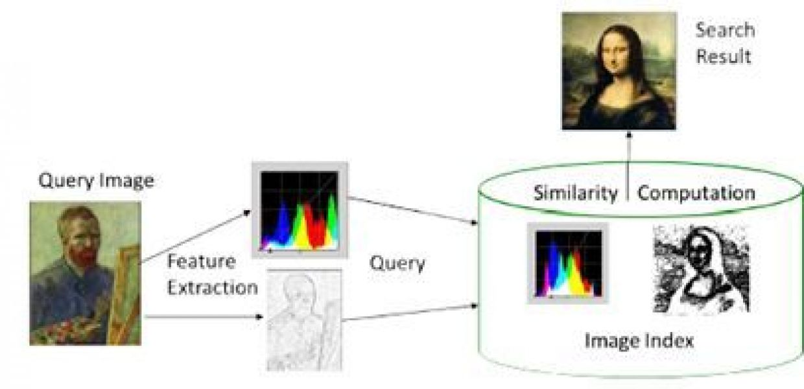
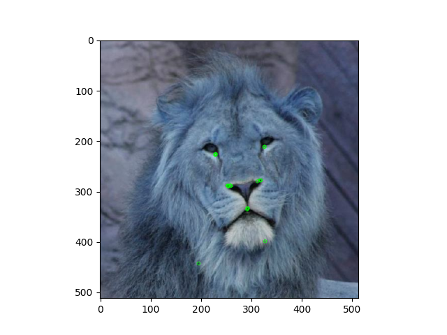
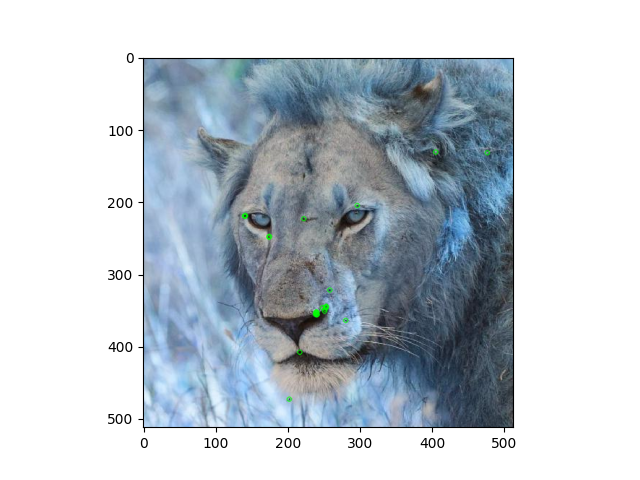
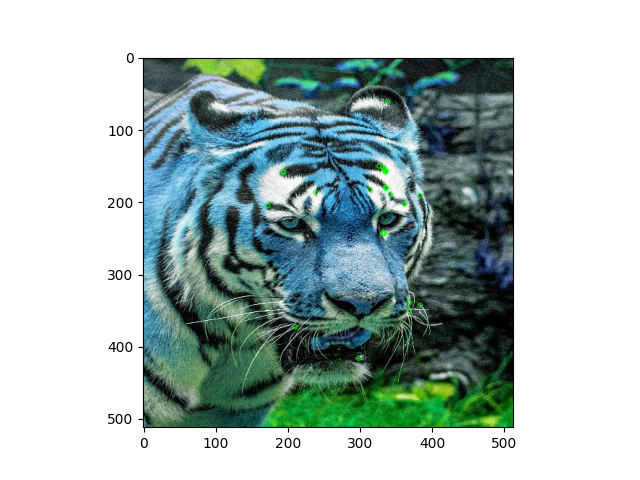
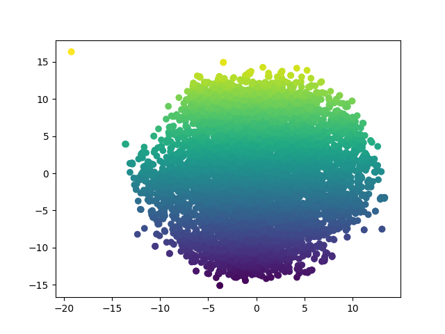

# 图片相似度实现

## 自编码器（AutoEncoder）

> [!NOTE]
> 要点：数据压缩、图像重建和分割

### 介绍

**什么是自编码器？**

神经网络有各种形状和大小，通常以其输入和输出数据类型为特征。例如，图像分类器是用卷积神经网络构建的。它们将图像作为输入，并输出类别的概率分布。

自编码器 (AutoEncoder，AE)是一类输入与输出相同的神经网络。它们的工作原理是将输入压缩为潜在空间表示（latent-space representation），然后根据该表示重建输出。


**简单的自编码器架构——输入被压缩然后重建**

### 卷积自编码器（Convolutional AutoEncoders）

自编码器的一个非常流行的用途是将其应用于图像。诀窍是用卷积层替换全连接层。这些层与池化层一起将输入从宽而薄（假设 100 x 100 像素，3 个通道 - RGB）转换为窄而厚。这有助于网络从图像中提取视觉特征，从而获得更准确的潜在空间表示。重建过程使用升采样（upsampling）和卷积。

得到的网络称为卷积自编码器（CAE）。


**卷积自编码器架构——将宽而薄的输入空间映射到窄而厚的潜在空间**

### 重建质量

输入图像的重建通常比较模糊，质量也较差。这是因为在压缩过程中我们丢失了一些信息。


**CAE 经过训练可以重建其输入**


**重建的图像模糊**

### 使用 CAE

**示例 1：超基础图像重建**

卷积自编码器对于重建非常有用。例如，它们可以学习从图片中去除噪音，或重建缺失的部分。

为了实现这一点，我们不使用同一幅图像作为输入和输出，而是使用噪声版本作为输入，使用干净版本作为输出。通过这个过程，网络学会填补图像中的空白。

让我们看看 CAE 可以做什么来替换眼睛图像的一部分。假设有一个十字准线，我们想将其移除。我们可以手动创建数据集，这非常方便。


**CAE 经过训练，可以消除十字准线**


**尽管很模糊，但重建的输入已没有十字准线**

> 现在我们的自编码器已经训练完毕，我们可以用它来去除我们从未见过的眼睛图片上的十字线！

**示例 2：超基础图像着色**

在这个例子中，CAE 将学习将一幅圆形和正方形的图像映射到同一张图像，但圆形用红色表示，正方形用蓝色表示。


**CAE 经过训练可以为图像着色**


**尽管重建效果模糊，但颜色基本正确**

CAE 在对图像的正确部分进行着色方面做得相当好。它知道圆圈是红色，正方形是蓝色。紫色来自蓝色和红色的混合，而网络在圆圈和正方形之间犹豫不决。

> 现在我们的自动编码器已经训练完毕，我们可以用它来给我们从未见过的图片着色！

### 高级应用

上面的例子只是概念证明，展示了卷积自编码器可以做什么。

更多令人兴奋的应用包括全图像彩色化，潜在空间聚类，或者生成更高分辨率的图像。后者是使用低分辨率作为输入，高分辨率作为输出来获得的。


**彩色图像着色**


**Alexjc的神经增强**

### 结论

在这篇文章中，我们了解了如何使用自编码器神经网络来压缩、重建和清理数据。获得图像作为输出是一件非常令人兴奋且非常有趣的事情。

注意： AE 有一个修改版本，称为变分自编码器（Variational AutoEncoders），可用于图像生成，但我将其保留以备后用。

### 代码

[图像重建](apple.ipynb)

[图像重建](flowers.ipynb)

[去噪](denoising.ipynb)

## 构造嵌入

要找到相似的图像，我们首先需要从给定的图像创建嵌入。为了创建嵌入，我们使用卷积自编码器。

这是一个无监督问题，我们使用自编码器来重建图像。在此过程中，编码器学习给定图像的嵌入，而解码器帮助重建。

可以总结如下

```py
encoded_image = encoder(input_image)
reoncstructed_image = decoder(encoded_image)
```

我们计算重建图像和输入图像之间的损失。

```py
loss_fn = nn.MSELoss()
loss = loss_fn(input_image, reconstructed_image)
loss.backward()
optimizer.step()
```

优化器更新编码器和解码器。

卷积编码器的输出跨所有图像批次收集到单个张量中。其维度取决于使用的 CNN 编码层数，即嵌入维度。

例如，如果嵌入维度为 (16, 256, 256)，且有 4000 张图像

我们得到的表示为（4000，16，256，256）

我们将这些嵌入展平为维度为 `(number_of_images, c * h * w)` 的 numpy 数组

其中 `c`、`h`、`w` 分别是图像的通道、高度和宽度。

我们将这些嵌入保存为 numpy 的 `npy` 格式。

## 查找相似图像

我们必须解决下图中的问题



给定一个新的查询图像，我们需要从嵌入中找到最相似的图像并返回它们。

在这里，我们利用了我们已经学过的嵌入。这些嵌入包含卷积编码器训练所用图像的表示。

### 为查询图像和搜索创建嵌入

我们使用编码器将查询图像转换为 `query_embedding` 。

这个 `query_embedding` 用于从我们在使用自编码器之前学到的嵌入中搜索相似的图像。

现在，我们使用 `K-Nearest Neighbors` 来查找 `K` 个最近嵌入。这些最近嵌入是预先学习的嵌入中最接近 `query_embedding` 的嵌入。

使用这些最近嵌入的索引，我们从图像文件夹中显示最相似的图像。

### 模型

- [链接](https://drive.google.com/drive/folders/1T6uS4O7LiuGMtXlRSMFmKAEDNQ08Ry25?usp=sharing)给出了一些使用样本数据集训练的模型。
- 它包含编码器、解码器和由自编码器生成的 numpy 嵌入。
- 这些是通过运行 `torch_train.py` 脚本获得的。

### 输出

- 待查询的图片


- 查询结果


## 查找相似特征

### 计算最接近给定特征的图像。

我们从给定的输入图像中确定突出的特征。

确定所需的特征。

它使用 `cv2.ORB()` ，这是一种快速查找定向、稳健特征的技术。

ORB（Oriented FAST and Rotated BRIEF）在给定的输入图像中提供主要特征。

ORB 中的特征被转换为嵌入。

我们将从自编码器获得的嵌入的维数降低为 ORB 嵌入。

这使我们能够使用最近邻来搜索匹配项。

然后，它在从自编码器获得的嵌入中搜索与来自 ORB 的嵌入类似的图像。

这样我们就得到了与图像中给定特征相似的图像。

### 输出

- 这是使用 ORB 计算特征的图像。



- 推荐符合这些特征的图像。





- 我已经在它们上面标出了关键点。
- 我们可以看到提取的特征是相似的。

## 图像聚类

从卷积自编码器学习到的嵌入用于对图像进行聚类。

由于嵌入的维数很大，我们首先采用快速降维技术（如PCA）来降低其维数。

这是必需的，因为 `T-SNE` 速度慢得多，并且在对大量嵌入进行聚类时会占用大量时间和内存。

之后我们使用 `T-SNE`（T-Stochastic Nearest Embedding, T-随机最近嵌入）进一步降低维数。

由于这些是无监督嵌入，因此聚类可能有助于我们找到类别。

### 聚类输出

由于所用的模型非常简单，因此簇（cluster）非常清晰。

`T-SNE` 需要时间来收敛并且需要大量的调整。

此外，还可以通过预训练模型等更好地学习嵌入。



聚类脚本为 `cluster_images.py`

它可以与使用自编码器学习的任意二维嵌入一起使用。