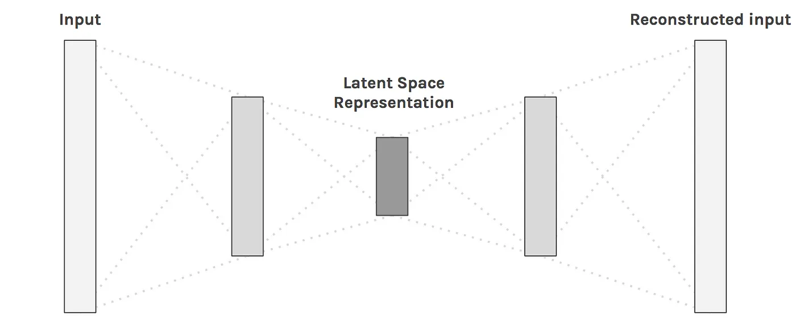
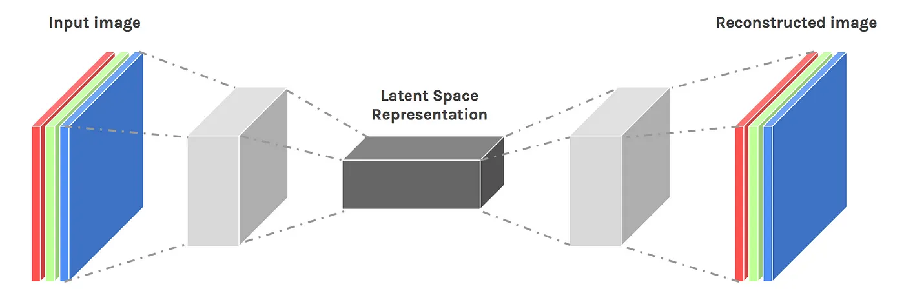
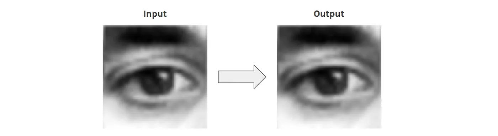
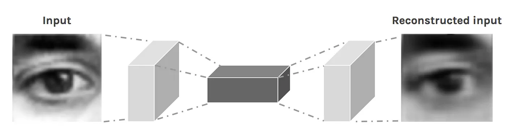
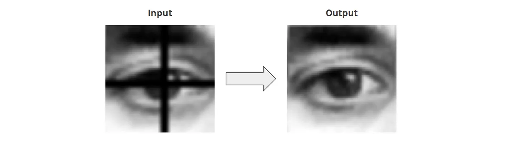
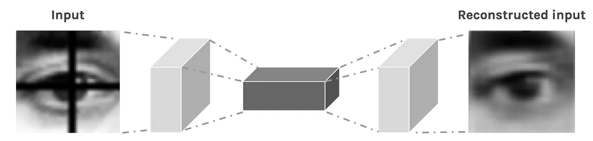
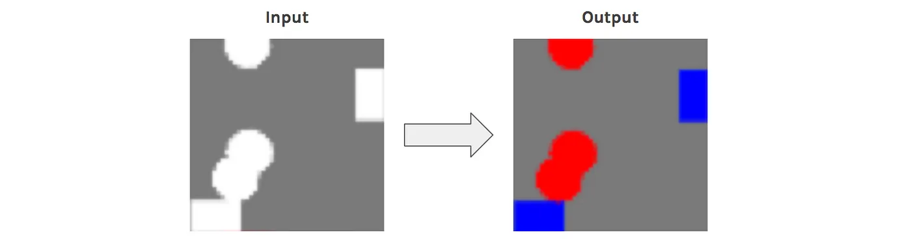
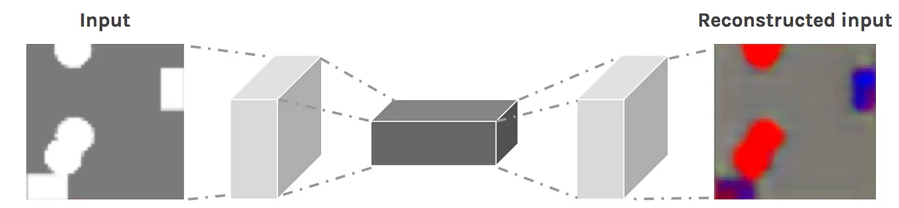
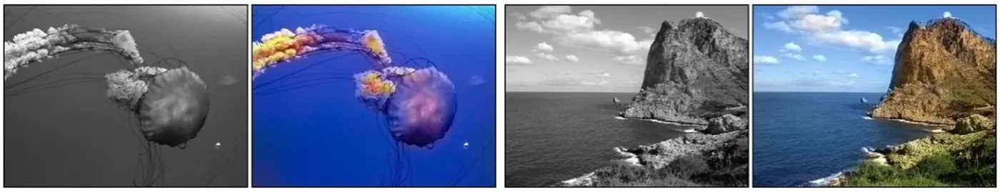
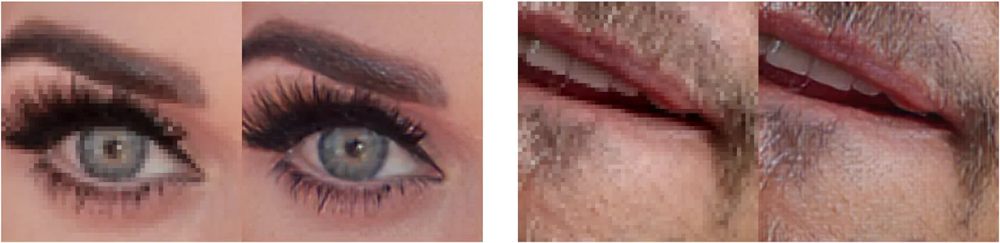

# 图片相似度实现

## 自编码器（AutoEncoder）

> [!NOTE]
> 要点：数据压缩、图像重建和分割

### 介绍

**什么是自编码器？**

神经网络有各种形状和大小，通常以其输入和输出数据类型为特征。例如，图像分类器是用卷积神经网络构建的。它们将图像作为输入，并输出类别的概率分布。

自编码器 (AutoEncoder，AE)是一类输入与输出相同的神经网络。它们的工作原理是将输入压缩为潜在空间表示（latent-space representation），然后根据该表示重建输出。

**简单的自编码器架构——输入被压缩然后重建**

### 卷积自编码器（Convolutional AutoEncoders）

自编码器的一个非常流行的用途是将其应用于图像。诀窍是用卷积层替换全连接层。这些层与池化层一起将输入从宽而薄（假设 100 x 100 像素，3 个通道 - RGB）转换为窄而厚。这有助于网络从图像中提取视觉特征，从而获得更准确的潜在空间表示。重建过程使用升采样（upsampling）和卷积。

得到的网络称为卷积自编码器（CAE）。

**卷积自编码器架构——将宽而薄的输入空间映射到窄而厚的潜在空间**

### 重建质量

输入图像的重建通常比较模糊，质量也较差。这是因为在压缩过程中我们丢失了一些信息。

**CAE 经过训练可以重建其输入**

**重建的图像模糊**

### 使用 CAE

**示例 1：超基础图像重建**

卷积自编码器对于重建非常有用。例如，它们可以学习从图片中去除噪音，或重建缺失的部分。

为了实现这一点，我们不使用同一幅图像作为输入和输出，而是使用噪声版本作为输入，使用干净版本作为输出。通过这个过程，网络学会填补图像中的空白。

让我们看看 CAE 可以做什么来替换眼睛图像的一部分。假设有一个十字准线，我们想将其移除。我们可以手动创建数据集，这非常方便。

**CAE 经过训练，可以消除十字准线**

**尽管很模糊，但重建的输入已没有十字准线**

> 现在我们的自编码器已经训练完毕，我们可以用它来去除我们从未见过的眼睛图片上的十字线！

**示例 2：超基础图像着色**

在这个例子中，CAE 将学习将一幅圆形和正方形的图像映射到同一张图像，但圆形用红色表示，正方形用蓝色表示。

**CAE 经过训练可以为图像着色**

**尽管重建效果模糊，但颜色基本正确**

CAE 在对图像的正确部分进行着色方面做得相当好。它知道圆圈是红色，正方形是蓝色。紫色来自蓝色和红色的混合，而网络在圆圈和正方形之间犹豫不决。

> 现在我们的自动编码器已经训练完毕，我们可以用它来给我们从未见过的图片着色！

### 高级应用

上面的例子只是概念证明，展示了卷积自编码器可以做什么。

更多令人兴奋的应用包括全图像彩色化，潜在空间聚类，或者生成更高分辨率的图像。后者是使用低分辨率作为输入，高分辨率作为输出来获得的。

**彩色图像着色**

**Alexjc的神经增强**

### 结论

在这篇文章中，我们了解了如何使用自编码器神经网络来压缩、重建和清理数据。获得图像作为输出是一件非常令人兴奋且非常有趣的事情。

注意： AE 有一个修改版本，称为变分自编码器（Variational AutoEncoders），可用于图像生成，但我将其保留以备后用。

### 代码

[图像重建](apple.ipynb)

[图像重建](flowers.ipynb)

[去噪](denoising.ipynb)

